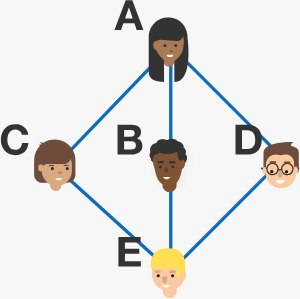

# 2-SAT 5 poeple party problem
## Problem statement
In a party with 5 people, it is possible that 2 people have 3 friends and 3 people have 2 friends, as shown in the graph to the right.  
In a party with 5 people, is it possible that there are 3 people with 3 friends and 2 people with 2 friends?

## My solution
I formalized the problem using Boolean algebra: variables are all the possible couples of nodes (aka party partecipants).  
Then I applied 2-sat : each costraint of 2-sat represents the number of friend a certain partecipant to the party has to have.

I wrote a simple python script to check 2-sat satisfiability and in that case get the solution.

As I thought since the beginning the problem is NOT-SAT

## Real solution
The problem is not satisfiable so it is not possible to have a party where `there are 3 people with 3 friends and 2 people with 2 friends`

## Better approaches
In an undirected vertex graph (as in this case) the degree is always two times the number of edges (For the handshaking lemma), hence an even number.  
Following the problem statements we would require to have `3 + 3 + 2 + 2 = 13` edges, which at this point appears as impossible.